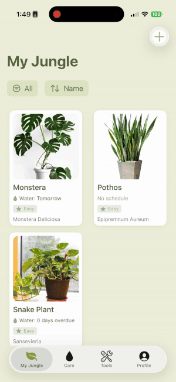

# PlantBuddy 🌱

Plant Buddy is a full-stack iOS application designed to help users track, manage, and maintain their plant collection. It features intelligent scheduling algorithms, an offline-first architecture, and a rich database of plant care information.

## 🚀 Key Features
- **Smart Scheduling Engine**: Automatically calculates future watering and fertilizing dates based on specific species needs.

- **Offline-First Architecture**: Users can manage tasks and view their gallery without internet access. Data synchronizes with the backend once connectivity is restored.

- **Rich Plant Metadata**: Integrated **[Perenual API]("https://perenual.com/docs/api")** to fetch and cache agronomic data (sunlight, toxicity, watering frequency) for thousands of species.

- **Visual History Log**: Maintains a transactional history of care actions, including an "Undo" feature for accidental task completion.

- **Local Notifications**: Deep integration with UserNotifications to deliver timely reminders even when the app is backgrounded.

## 🛠 Tech Stack

**iOS Client (Mobile)**

- Language: Swift 5
- Framework: SwiftUI
- Architecture: MVVM (Model-View-ViewModel)
- Concurrency: Async/Await
- Networking: URLSession with Custom Caching Layer

**Backend API**

- Framework: Django REST Framework (Python)
- Database: PostgreSQL (Relational Data Model)
- Deployment: Dockerized containers (Ready for AWS/Heroku)

## ▶️ How to Run the App

**Backend API**
- `cd backend`
- Create and activate a virtual environment
- `pip install -r requirements.txt`
- Run database migrations: `python manage.py migrate`
- Start the server: `python manage.py runserver` (defaults to `http://localhost:8000`)

**iOS App**
- `cd ios/PlantBuddy`
- Open the Xcode project: `open PlantBuddy.xcodeproj`
- Make sure the API base URL in `PlantService` points to your backend (e.g. `http://localhost:8000/api/`)
- Select a simulator or device and press **Cmd + R** to build and run